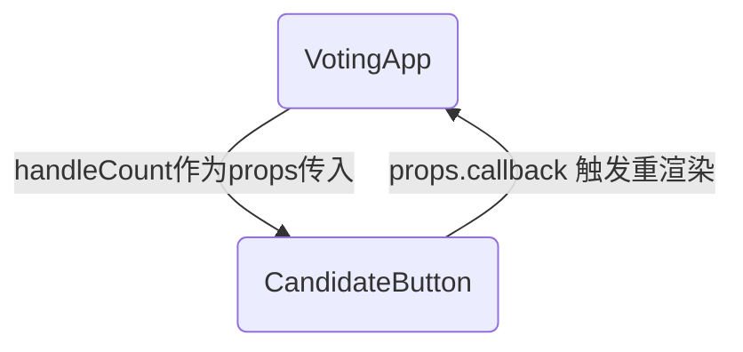

# Interactive React

这里讨论任何使用React Library构建网页互动，包括如何处理事件、通过钩子函数（hooks）来给组件存储动态数据，以及介绍如何实现某些特定的互动操作（比如使用表格和下载数据）。

## 事件处理

React支持多种多样的用户互动操作，就像DOM和JQuery一样：注册一个事件监听器并提供特定的回调函数在某个事件发生的时候执行。

在React中，你在**组件中返回的JSX元素里**使用 `on` + `特定事件名` 的组合来作为属性名称，而给该属性值赋值为特定回调函数来绑定事件。

该属性想要使用小驼峰命名法（camelCase），比如 `onClick` 或者 `onMouseOver` 等等。如果你想查看所有支持的事件处理属性名，见： [synthetic events](https://reactjs.org/docs/events.html#supported-events).

```jsx
//A component representing a button that logs a message when clicked
function MyButton() {
    //A function to call when clicked. The name is conventional, but arbitrary.
    //The callback will be passed the DOM event (just like with DOM callbacks)
    const handleClick = (event) => {
        console.log("clicky, clicky");
    }
    
        //make a button with an `onClick` attribute!
    //this "registers" the listener and sets the callback
    return <button onClick={handleClick}>Click me!</button>
}
```

一般来说，回调函数在组件内定义，成为“函数中的函数”（因为组件也是函数！），所以按照惯例我们会将嵌套的函数用箭头函数定义。

DOM会为返回的 `<button>` 元素绑定事件。

你也可以在返回的JSX里面的元素里面定义回调函数，但易读性差，不推荐。

```jsx
function MyButton() {
    return <button onClick={(evt) => console.log("clicky clicky")}/>
}
```

### 别给组件指定事件属性！

**注意：是在React的元素（即HTML元素）里注册事件！不可以给React组件注册事件！！！**如果你在React组件里尝试指定事件处理属性，那么实际上你只是给组件绑定了一个Props！

> If you tried to specify a `<MyButton onClick={callback}>`, you would be passing a *prop* that just happened to be called `onClick`, but otherwise has no special meaning!


> 尽管功能类似，但React的事件处理属性和HTML的事件处理器不一样，即：`onClick` ≠ `onclick` ！React属性只适用于React event system。


## State和Hook

为了使得React的组件能根据用户的动作而实时改变，我们需要追踪组件的状态（State），这就需要用到用到*state*，注意，只有会不停改变状态的数据才能被声明为state，如果变量是**一成不变**的，或者**并未在DOM中直接或间接地被渲染**，那就不是state！

当state发生变化的时候，组件就会根据state的变化被重新渲染！

对于函数组件，state可以用State Hook来添加到组件中。

> Hooks were introduced with React v16.8 (October 2018), and thus are the “new” current way of handling state. For details on older techniques (which require using *class components*), see [*State in Class Components*](https://info340.github.io/class-components.html#state-in-class-components).

> Fun fact: hooks are basically an example of [*mixins*](https://en.wikipedia.org/wiki/Mixin), which are an object-oriented technique for including/injecting data or behavior in a class without needing to inherit that behavior from a parent class.

State Hook实际上是React提供的一个函数：`useState()` ，使用 named export 来从React Library里将其引入：

```js
//import the state hook function
import React, { useState } from 'react';
```

然后，一般在函数组件的最上方使用 `useState()` 函数来创建state，这样后面的代码就可以使用创建的state变量了：

```jsx
function CountingButton() {
    //Define a `count` state variable, initially 0
    const [count, setCount] = useState(0);

    //an event handling callback
    const handleClick = (event) => {
        setCount(count+1); //update the state to be a new value
    }

    return (
        { /* a button with the event handler that displays the state variable */}
        <button onClick={handleClick}>You clicked me {count} times</button>
    );
}
```

在组件被渲染/重新渲染的时候，state变量会被追踪和储存，你可以将state变量当成一个**实例变量**，实际上它被存储在一个对象实例变量中（object instance variable）。

函数 `useState` 的参数是state变量的初始值，在上面的代码中，`count` 被初始化为0.

函数 `useState` 的返回值是一个有两个元素的数组：第一个是当前的state变量的值，第二个是用来改变该值的set函数，你可以使用“array destructuring”来分别将这两个值赋给不同的变量。

你可以将返回值命名为啥都行，比如：

```js
const [countVariable, functionToUpdateCount] = useState(0)
```

> Because the function is a “setter” it’s usually named as such (`setVARIABLE`), but this is not required. It’s just a function; you can name it whatever you want.


### 更新state

不可以直接修改state变量！这也是为何state变量被声明为 `const` 的原因。

请使用set函数来更新。当set函数被调用的时候，不仅仅state变量被更新，其对应的组件也会被重新渲染。

React会**异步([*asynchronous*](https://reactjs.org/docs/state-and-lifecycle.html#state-updates-may-be-asynchronous))**地将一打state变量的更新打包，然后用一个请求一次性将页面中需要更新的组件重新渲染完成，这样，既减少了重新渲染的次数，又保证了页面刷新的高效性。

```jsx
//An Component with a callback that doesn't handle asynchronous state changes
function CounterWithError(props) {
    const [count, setCount] = useState(3) //initial value of 3

    const handleClick = (event) => {
        setCount(4); //change `count` to 4
        console.log(count); //will output "3"; state has not changed yet!
    }
}
```

> this example, because `setCount()` is asynchronous, you can’t immediately access the updated state variable after calling the function. You instead need to wait for the component to “rerender”—when the component’s DOM is regenerated, it will use the updated value. If you want to see that value, log it out right before you return the DOM (not inside of the click event handler).

在重新渲染的时候，你的函数组件会被再次重新调用，这意味着所有函数组件里的逻辑都会被重新执行一遍！

> **警告：**永远不要在函数组件内之间调用set函数，否则会触发**无限循环的递归调用**！

在函数组件里的回调函数里，你可以为一个组件添加多个state变量：

```jsx
//Example from React documentation
function ExampleWithManyStates() {
    //Declare multiple state variables!
    const [age, setAge] = useState(42);
    const [fruit, setFruit] = useState('banana');
    const [todos, setTodos] = useState([{ text: 'Learn Hooks' }]);
}
```

尽管可以把一堆state值存放在一个数组或者对象里，上面这种做法更加简洁，而且在只有少部分数据需要更新时无需更新整个数组或对象，因此十分推荐！

同样，如果你要使用set函数更新一个类型为数组或对象的state变量，请**创建一个全新的变量**而不是将原state变量的成员该值后传递给set函数，因为React不会检查原变量的成员，这是为了保证数据的不变性：

- 错误的示范：

```js
function TodoListWithError() {
    //a state value that is an array of objects
    const [todos, setTodos] = useState([{ text: 'Learn Hooks' }]);

    const handleClick = (event) => {
        todos[0].text = "Fix bugs"; //modify the object but don't make a new one
        setTodos(todos) //This won't work!
    }
}
```

- 正确的示范：

```jsx
function TodoList() {
    //a state value that is an array of objects
    const [todos, setTodos] = useState([{ text: 'Learn Hooks' }]);

    const handleClick = (event) => {
        //create a copy of the array using the `map()` function
        const todosCopy = todos.map((todoObject, index) => {
            if(index == 0) { //transform objects if needed
                todoObject.text = "Fix bugs"
            }
            return todoObject; //return object to go into new array
        })
        setTodos(todosCopy) //This works!
    }
}
```

一般的，可以使用 `.map()` 来创建新数组，使用 spread operator 或 [`Object.assign()` function](https://developer.mozilla.org/en-US/docs/Web/JavaScript/Reference/Global_Objects/Object/assign) 来创建新对象。

```js
//an original object
const original = {a: 1, b: 2};

//Create a copy, taking the property of `original` and assigning them into
//a fresh object
const copy = { ...original } //using the spread operator
console.log(copy) //{a: 1, b: 2}
console.log(copy == original) //false, different objects
```

### State vs. Props

State是会随着与用户交互而改变的数据，而Props是父组件传入的数据，你可以将props的值赋给一个State变量，但props的值是不变的，只是恰好作为state变量的初值罢了。

> `props` are for information that doesn’t change from the Component’s perspective, including “initial” data. `state` is for information that will change, usually due to user interaction.

```jsx
//A component representing a count
function Counter(props) {
    const [count, setCount] = useState(props.startAt)
}

let counter = <Counter startAt={5} />
```


出于对性能的考虑，应当尽可能地使state变量的数量保持最小，如果你不确定某个值是否应该为state，考虑以下三个问题：

1. 如果这个值是props传递进组件的，那么大概率它不应该是一个state；
2. 如果该值不会发生变化，那么它不是state；
3. 如果这个值是基于另一个props或state变量，那么它不是state。

### State的提升

即Lifting up state，由于父组件可以轻松地将state变量作为props传递给子组件，而state变量在兄弟组件之间难以传递，因此，对于某些情境下需要互通state数据的兄弟组件来说（比如一个搜索框和搜索结果栏），我们会把这些state放到它们**层级最低的共同的父组件**中，在父组件里定义一个可以修改该state的回调函数作为props传递给子组件，让子组件发生交互的时候调用该回调函数触发父组件的重新渲染。

由于父组件重新渲染的时候也会顺便生成新的子组件，这样就实现了父组件和兄弟组件和它自己的重渲染。

```jsx
<App>
  <SearchForm /> {/* has the data */}
  <ResultsList /> {/* needs the data */}
</App>
```

下面是一个 `VotingApp` 的例子，通过计算哪个按钮被点击的次数最多而显示结果（`winner`）。

```jsx
function VotingApp(props) {
    //initialize the state counts, one for each color
    //using a single state value so that there is only one "update" function
    const [counts, setCounts] = useState({red: 0, blue: 0})

    //a function to update the state
    //expects a "color" for which button was clicked
    const handleCount = function(color) {
        console.log(color + " got a vote!");

        const newCounts = { ...counts } //make a duplicate of the object
        newCounts[color]++; //update the local copy

        setCounts(newCounts) //update the state with the changed copy
    }

    //render based on current state
    let winner = "tie";
    if(counts.red > counts.blue) winner = "red"
    else if(counts.blue > counts.red) winner = "blue"
    return (
        <div>
            <p>Current winner is: {winner}</p>
            {/* Pass the callback to each button as a prop */}
            <CandidateButton color="red" winner={winner} callback={handleCount} />
            <CandidateButton color="blue" winner={winner} callback={handleCount} />
        </div>
    );
}

function CandidateButton(props) {
    const handleClick = () => {
        //On click, execute the given callback function (passing in own name)
        props.callback(props.color)
    }

    //render based on current props
    let label = "I am not winning";
    if(props.winner === props.color)
        label = "I am winning!"

    return (
        <button className={props.color} onClick={handleClick}>
            {label}
        </button>
    );
}
```

流程图如下：



总结起来，制作互动React应用可以遵循下列步骤：

1. 先使用组件建立一个静态的（没有任何互动的）版本；
2. 找出所有需要随着互动而改变的变量，它们就是要存储在state里的变量；
3. 将state变量存在需要它们的组件的最低层的共同祖先组件中；
4. 将上述state作为props传入子组件；
5. 将回调函数作为props传递给子组件；

## 互动实例

一些常用的React实例：

### 表格

我们常常要创建一些表格（[forms](https://reactjs.org/docs/forms.html)），这样用户就可以填写并提交一些我们想要的信息。	

在HTML中，我们用 `<input>` 元素来追踪用户在表格中输入的值，这些值由属性 `value` 来追踪：

```js
//Select the <input type="text"> element
let textInput = document.querySelector('input[type="text"]');

//Event that occurs whenever the input is changed
textInput.addEventListener('change', (event) => {
    let input = event.target;
    console.log(input.value); //access that elements "state"
});
```

有时候我们会需要将用户的输入作为一个AJAX请求发送出去，或者你只是想验证一下用户输入的密码是否符合安全规范。但在React中使用input往往会引起一些问题。因此推荐的方法是使用 [**controlled Components**](https://reactjs.org/docs/forms.html#controlled-components) 。

这种方法就像是用React组件读取用户在 `<input>` 元素中输入的内容，即通过事件处理 `onChange` 触发回调函数拿到input里的内容，把用户输入的内容赋给的组件中的 `<input>` 的 `value` 属性和定义的state变量（在下面为 `inputValue`），通过state变量的改变触发重渲染。

> It’s like React is snatching the data from the `<input>` and then claiming credit for it.

```jsx
function MyInput(props) {
    const [inputValue, setInputValue] = useState('')//initialize as empty string

    //respond to input changes
    const handleChange = (event) => {
        //get the value that the <input> now has
        let newValue = event.target.value

        //update the state to use that new value, rendering the component
        setInputValue(newValue);
    }

    return (
        <div>
            {/* The input will be rendered with the React-controlled value */}
            <input type="text" onChange={handleChange} value={inputValue} />
            <p>You typed: {inputValue}</p>
        </div>
    );
}
```

**Tips：**

- 当然，你也可以用一个controlled form渲染多个 `<input>` 标签，这样你就可以在同一个组件里用不同的state变量追踪它们的输入值了。这在验证“请重新输入密码”栏里的密码是否和之前输入的密码一致时非常有用！
- 在React中维护表格的健壮性其实是一件很困难的事！ (especially when compared to other frameworks such as Angular). 你可以使用外部的库，比如 [Formik](https://jaredpalmer.com/formik) 来帮助你开发表格并避开一些很难考虑到的极端情况。

### 用AJAX获取数据

生命周期回调函数（lifecycle callback functions）最常见的用途之一是异步访问数据，例如通过 AJAX 请求获取数据（见第 [18 章](https://info340.github.io/ajax.html#ajax)）。本节将详细介绍如何在 React 框架中异步加载数据。

首先， React 代码是使用 Webpack 转译的。因此，某些 API（包括 `fetch()`）并不像现代浏览器那样 "内置 "于 React。正如第 18 章所述，为了支持这些 "其他 "浏览器，您需要加载一个 *polyfill*。您可以在 React 中安装 whatwg-fetch 库，然后在 React 代码中导入该 polyfill：

```bash
# On command line, install the polyfill
npm install whatwg-fetch
```

```js
//In your JavaScript, import the polyfill (loading it "globally")
//This will make the `fetch()` function available
import 'whatwg-fetch';
```

记住，`fetch()` 是异步下载数据的。因此，如果要下载一些数据来显示，可能需要一段时间才能到达。我们不希望 React  "等待 "数据（因为 React 的设计宗旨就是快速）。因此，最好的做法是发送 `fetch()` 请求获取数据，然后在数据下载完成后调用 set state 函数用下载的数据更新组件。(可以将其数据状态初始化为的 "空数组"）。

在 React 中，从互联网获取数据被认为是一种[**side effect**](https://en.wikipedia.org/wiki/Side_effect_(computer_science))。函数组件最好只做一件事：返回将在屏幕上呈现的 DOM。但下载数据会修改该框架之外的东西，因为它会修改网络状态/信息，甚至远程服务器的状态！因此，直接在组件函数内部调用 fetch() 是糟糕的编程风格，并可能在组件渲染时引发问题和错误。例如，如果获取的数据返回太快或太慢，尝试设置还未绑定到DOM的状态变量（从而重新渲染）会导致 React 崩溃。如果state更新了并重新渲染了组件，再次调用组件函数将导致组件再次下载数据，从而可能造成无限循环！

因此，你可以使用 [**effect hook**](https://reactjs.org/docs/hooks-effect.html),  即 React 函数 **`useEffect()`**。这可让您让钩子和组件的生命周期挂钩，指定组件完成渲染后应运行的某些代码（函数）。任何会产生副作用的代码（例如下载数据、在 React 渲染之外操作 DOM 或设置对数据源的订阅）都应通过effect hook来运行。

```jsx
//import the hooks used
import React, { useState, useEffect } from 'react';

function MyComponent() {
    //store the data in a state variable, initialized as an empty array
    const [data, setData] = useState([]);

    //specify the effect hook function
    useEffect(() => {
        fetch(dataUri) //send AJAX request
          .then((res) => res.json())
          .then((data) => {
            let processedData = data.filter(...).map(...) //do desired processing
            setData(processedData) //change the state and re-render
          })
    }, []) //empty array is the second argument to the `useEffect()` function.
           //It says to only run this effect on first render

    //Map the data values into DOM elements
    //Note that this works even before data is loaded (when the array is empty!)
    let dataItems = data.map((item) => {
        return <li key={item.id}>{item.value}</li>; //return DOM version of datum
    })

    //render the data items (e.g., as a list)
    return <ul>{dataItems}</ul>;
  }
}
```

 `useEffect()` 函数需要两个参数：

- 一个回调函数作参数，该函数将在组件渲染后运行。关于如何使用该函数，请注意以下几点：
  - 与一样，必须 `import` 效果钩子函数 `useEffect`（作为named import）。
  - `useEffect()` 函数将组件渲染后运行的回调函数一般声明为一个箭头函数，注意，**该回调函数不需要参数。**
  - 在 `useEffect()` 回调函数内部执行正常的 `fetch()` 调用。请注意，下载的数据会通过调用 set state 函数（本例中名为 `setData()`）分配给组件的状态变量。
- 第二个参数是一个数组，表示当数组内指定的状态发生变化时才重新渲染组件（如果是空数组，那么表示仅在第一次渲染组件的时候运行 effect函数）。

> By default, the effect callback will be executed after *each* time the component renders. That means that if the component needed to re-render (because a prop changed for example), then the data would be downloaded a second time! To avoid this, you can pass the `useEffect()` function an optional second argument. This argument should be an array of values that the effect “depends on”—the effect will only be re-run if one of these variables changes between renders:

虽然理论上组件要渲染两次（一次没有数据，另一次有数据），但 React 可以将这些请求处理打包在一起处理，如果数据下载速度足够快，用户就不会注意到。“This is also a good reason to [conditionally](https://reactjs.org/docs/conditional-rendering.html) include DOM elements like spinners when rendering data.”有条件的包含DOM元素？

`useEffect()` 函数无需返回任何值。事实上，它能返回的唯一值是一个 "清理 "回调函数，每当组件从 DOM 中移除时，React 都会运行该函数：

```js
useEffect(() => {
    //...
    return function cleanup() { //function name is arbitrary
        console.log("component has been removed!")
    }
})
```

只有在需要cleanup的时候，比如：subscribing to a data source or handling some user authentication behaviors. 普通的 `fetch()` 不需要cleanup。

> React里有很多种hooks，更多信息请参考 [documentation](https://reactjs.org/docs/hooks-reference.html)。但一般来说，只有在遇到architectural problem (e.g., you have a lot of repeated code)你才需要使用hook — 否则： stick with the basic structure of props and state!.

