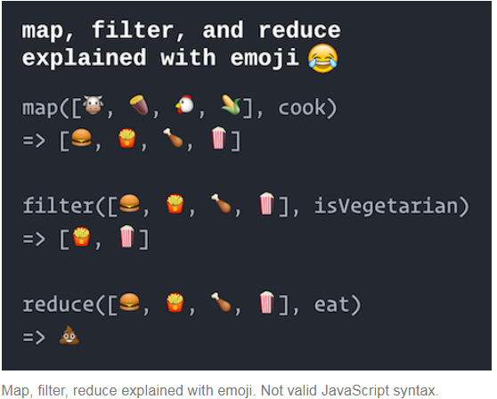

# JavaScript

JavaScript和Java没啥关系。它是ECMAscript标准的实现，所以JavaScript的版本又叫做`ES`，本篇描述了ES5的语法。

## 发展历程

ES5是2009年提出的，ES6在2015年提出，已经被大量浏览器支持。最后是2016年完成的ES7，但还未被可靠的支持。

每个版本都会添加一些额外的简化语法，特定的关键字以及核心函数。每个版本也都前向兼容。只要浏览器内置的解释器支持，就可以使用JavaScript的新特性。


## JavaScript的运行

在浏览器中，当页面的HTML被逐行渲染时，遇到`<script>` 标签时，就会下载并执行JavaScript语句。

```html
<!-- execute the script.js file -->
<script src="path/to/my/script.js"></script>
```

**注意：**`<scrip>` 标签不是 empty的，这意味着它需要 `</script>` 来结尾。你也可以在标签内直接写JavaScript语句，但是除了调试的时候，其他时间不建议这么做。

### \<script>标签的位置

`<script>` 标签既：

- 放在 `<head>` 标签的里面时，在页面内容加载前执行JavaScript语句。
- 放在`<body>` 标签内的最后一行时，在页面内容加载完毕后执行JavaScript的语句。

主流做法是在 `<body>` 之后写 `<script>` 语句，但你也可以使用 `defer` 属性来设置在内容加载完毕之后再下载和运行JavaScript语句，但IE9及以前的IE不支持这个特性。

```html
<!DOCTYPE html>
<html>
<head>
  <!-- include here to run before the page appears -->
  <script src="js/script.js"></script>
</head>
<body>
   ... content ...

   <!-- include here to run "after" html appears -->
   <!-- we will usually do this -->
   <script src="js/script.js"></script>
</body>
<html>
```

你还可以在浏览器里面打开终端来使用JavaScript并查看输出和打印信息，**You should always have the JavaScript Console open when developing JavaScript code, since this is where any error messages will appear!**

### 使用node.js

使用JavaScript的解释器node.js在本地命令行里运行JavaScript。

在安装了node的机器的命令行里输入 `node` 语句来打开 *interactive Node session*，然后在出现的 `>` 后输入要执行的语句。要退出会话，输入 `quit()` 后回车或按 `ctrl` + `z` 即可。

如果要运行一个 `.js` 文件，输入：

```shell
node my-script.js
```

## JavaScript的基本语法

在一个`.js`文件中是没有 `main()` 函数的概念的。

程序逐行执行，每行可声明一个变量或函数，然后在后续的行使用它们。**每行的结尾最好加上 `;` ，虽然解释器有时可以容忍你漏掉分号，但是为了避免意外错误的发生，还是加上为好。**

要打印某些信息，使用：`console.log()`

### strict mode

在文件顶部声明：

```javascript
'use strict';
```

可以告诉解释器使用严格模式。（注意这是一个解释器声明而不是字符串！）

在严格模式下，解释器会更加严谨地处理语法。

比如，如果你尝试使用一个未被声明的变量的时候，严格模式下解释器将报错，而非严格模式下，编译器就使用 `undefined` 作为值。严格模式可以捕捉到一些silly mistakes。

> **ALWAYS USE STRICT MODE!** It will help avoid typo-based bugs, as well as enable your code to run more efficiently.

### 变量

#### let和var

我们使用 `let` 关键字来定义变量。

注意，我们不会声明变量的类型(e.g., `int` or `String`)，变量类型在JavaScript里是动态的，即变量的类型就是赋值给它的值的类型(e.g., `Number`, `String`, etc.)。

```javascript
let message = 'Hello World';  //a String
console.log(typeof message);  //=> `string`

let shoeSize = 7;  //a Number
console.log(typeof shoeSize);  //=> 'number'
```

- 使用 `typeof` 运算符来查看变量的类型。

```shell
> let a = 10;
> typeof a;
'string'
```


- 在JavaScript里使用camelCase来命名变量。

> **Pro Tip:** Even though variables in JavaScript loosely typed, the data type of a value is still important! In order to help keep track of the type of each variable in JavaScript, include the type in the variable name. For example: `textString`, `wordsArray`, `totalNum`, `itemStr`, etc..


- 声明的变量默认值为 `'undefined'` ，类似Java里的 `null`。尽管JavaScript里也有 `null` 类型，但不常用。

```js
//create a variable (not assigned)
let hoursSlept;
console.log(hoursSlept);  //=> undefined
```


- 注意，`let` 关键字是ES6标准引入的，之前使用的是 `var` 关键字。它们之间的区别：
  - `let` 的作用域是 `{}` 之间的区域
  - `var` 的作用域是该变量定义的函数内，即如果你在此函数内的 `if` 语句模块内用 `var` 定义的变量仍在此函数的 `if` 语句模块外有效
  - 使用 `let` 最好，因为作用域更清晰，但如果你要兼容老设备：e.g., IE 10, Safari 9.3, Android 4.4，那还是用 `var` 吧，或者transpile你的代码。

#### const

常数变量也可以使用 `const` 来声明（只读变量？），且只能被赋值一次。

const变量的作用域和let一样，都是**block scoped**。

```js
const ISCHOOL_URL = 'https://ischool.uw.edu'; //declare constant
ISCHOOL_URL = 'https://example.com'; //TypeError: Assignment to constant variable.
```

### 基本数据类型

### Number

可以进行数值运算的类型，常用的数学函数可以使用 预置的 `Math` 类来调用。

```js
let x = 5;
typeof x;  //'number'
let y = x/4;
typeof y;  //'number'

//numbers use floating point division
console.log( x/4 );  //1.25

//use the Math.floor() function to do integer division
console.log( Math.floor(x/4) );  //1

//other common Math functions available as well
console.log( Math.sqrt(x) );  //2.23606797749979
```


### String

使用 `'` 或 `"` 括起来的就是String类型的变量，推荐使用单引号。

可以使用加好对字符串进行连接。

```js
let name = 'Joel';
let greeting = 'Hello, my name is '+name; //concatenation
```

String也有一堆方法。和Java一样，这里String类型也是immutable的。所以String方法会返回一个新字符串：

```javascript
let message = 'Hello World';
let shouted = message.toUpperCase();
console.log(shouted);  //=> 'HELLO WORLD'
```


### Boolean

只要两种值：`true` 和 `false` 

通常使用比较逻辑时返回的值为布尔值，布尔值也支持逻辑运算。


### Array

JavaScript Arrays are written as literals inside square brackets **`[]`**. Individual elements can be accessed by (0-based) *index* using **bracket notation**.

```js
//an array of names
let names = ['John', 'Paul', 'George', 'Ringo'];

//an array of numbers (can contain "duplicate" values)
let numbers = [1, 2, 2, 3, 5, 8];

//arrays can contain different types (including other arrays!)
let things = ['raindrops', 2.5, true, [3, 4, 3]];

//arrays can be empty (contain no elements)
let empty = [];

//access using bracket notation
console.log( names[1] );  // "Paul"
console.log( things[3][2] );  // 3

numbers[0] = '340';  //assign new value at index 0
console.log( numbers );  // [340, 2, 2, 3, 5, 8]
```

JavaScript的数组是可以 outbound 的，你可以给任意的下标元素赋值，数组会自动增长到这个下标的长度，并且给中间未赋值的元素赋值为 `undefined` 。

获取数组的长度，可以使用 `.length` 属性，**注意，返回值永远是最后一个元素 + 1**。

```js
let letters = ['a', 'b', 'c'];
console.log(letters.length);  // 3
letters[5] = 'f';  //grows the array
console.log(letters);  // [ 'a', 'b', 'c', , , 'f' ]
                       //blank spaces are undefined
console.log(letters.length);  // 6
```

数组也有许多方法，你可以使用这些方法来操弄数组，就像Java的 `ArrayList` 一样：

```js
//Make a new array
let array = ['i','n','f','o'];

//add item to end of the array
array.push('340');
console.log(array); //=> ['i','n','f','o','340']

//combine elements into a string
let str = array.join('-');
console.log(str); //=> "i-n-f-o-340"

//get index of an element (first occurrence)
let oIndex = array.indexOf('o'); //=> 3

//remove 1 element starting at oIndex
array.splice(oIndex, 1);
console.log(array); //=> ['i','n','f','340']
```


### Object

包含键值对的一种数据结构。使用“String”类型作为“key”来获取其中储存的"value"。

value的数据类型可以是任意的，比如“Number”，“Array”，甚至是另一个Object。

JavaScript的Object数据类型更像是Java里的HashMap（实际上JavaScript的Object就是用Hash table数据结构来实现的），Python里的dictionary，而**和面向对象编程里的对象没啥关系**（当然，它也可以用来实现面向对象编程）。

```js
//an object of ages (explicit Strings for keys)
//The `ages` object has a `sarah` property (with a value of 42)
let ages = {'sarah':42, 'amit':35, 'zhang':13};

//different properties can have the same values
//property names with non-letter characters must be in quotes
let meals = {breakfast:'coffee', lunch: 'coffee', 'afternoon tea': 'coffee'}

//values can be of different types (including arrays or other objects!)
let typeExamples = {number:12, string:'dog', array:[1,2,3]};

//objects can be empty (contains no properties)
let empty = {}
```

- 注意，Object里的数据是无序的，你使用 `console.log()` 打印它的属性值时，打印的结果是乱序的！

- 用 `console.log` 打印Object的时候，所有属性都会完整地被打印出来。但是，如果你尝试把对象转换为“String”类型，比如 `let output = 'my obj' + expObj`，那么最终打印出的结果是：

  ```shell
  my obj[obj Object]
  ```

  打印的是"string"版本的Object，显然不是我们想要的结果。注意下面两种打印Object的方法的区别！

  ```js
  let myObject = {a:1, b:2}
  
  //convert object to string, won't log nicely
  console.log("My object: " + myObject); //=> My object: [object Object]
  
  //log the object directly
  console.log("My object ", myObject); //=> My object {a: 1, b: 2}
  ```

#### 面向对象式编程

可以像Java的对象一样使用JavaScript的Object数据类型，每个property就像是一个attribute（或称之为“*实例对象*”）一样。

```js
//an object representing a Person (spacing is for readability; white-space is ignored)
let person = {
  firstName: 'Alice',
  lastName: 'Smith',
  age: 40,
  pets: ['rover', 'fluffy', 'mittens'],  //value is an array
  favorites: {   //value is another object
    music: 'jazz',
    food: 'pizza',
    numbers: [12, 42]  //value is an array
  }
}
```

#### Accessing Object

两种方法：

- `obj['key']`
- `obj.key`

如果访问了不存在的对象，那么得到的值是 `undefined` 。

两种方法的区别：

使用方括号 `[]` 访问时可以在里面放表达式或变量的值，如：`obj[variable]`，但其他情况下建议使用 `obj.key` 这种用法。

```js
let favorites = {music: 'jazz', food: 'pizza', numbers: [12, 42]};

//access variable
console.log( favorites['music'] ); //'jazz'

//assign variable
favorites['food'] = 'cake';  //property name is a string
console.log( favorites['food'] ); //'cake'

//access undefined key
console.log( favorites['language'] ); //undefined
favorites['language'] = 'javascript'; //assign new key and value

//access nested values
console.log( favorites['numbers'][0] ); //12

//use a variable as the "key"
let userInputtedTopic = 'food'; //pretend this value is supplied dynamically
console.log(favorites[userInputtedTopic]);  //'cake'
```

```js
let favorites = {music: 'jazz', food: 'pizza', numbers: [12, 42]};

//access variable
console.log( favorites.music ); //'jazz'

//assign variable
favorites.food = 'cake';
console.log( favorites.food ); //'cake'

//access undefined key
console.log( favorites.language ); //undefined
favorites.language = 'javascript'; //assign new key and value

//access nested values
console.log( favorites.numbers[0] ); //12
```


**获取含有所有key的数组**：<span id="obj-key-method">使用 `Object.key()` 方法</span>：

```js
let ages = {sarah:42, amit:35, zhang:13};
let keys = Object.keys(ages);  // [ 'sarah', 'amit', 'zhang' ]
```

**注意：** JavaScript没有获取全部value的方法，你只能遍历所有的key来逐个获取它们的values。


#### Object Array

Object和Array可以嵌套使用：

> As noted above, both arrays and objects can have values of any type—including other arrays or objects! The ability to nest objects inside of objects is incredibly powerful, and allows us to define arbitrarily complex information structurings (schemas). 

```js
//an arbitrary list of people's names, heights, and weights
let people = [
    {name: 'Ada', height: 58, 'weight': 115},
    {name: 'Bob', height: 59, 'weight': 117},
    {name: 'Chris', height: 60, 'weight': 120},
    {name: 'Diya', height: 61, 'weight': 123},
    {name: 'Emma', height: 62, 'weight': 126}
]
```

> Each object (record) acts as a “row” in the table, and each property (feature) acts as a “column”. As long as all of the objects share the same keys, this array of objects *is* a **table**!


### 类型转换

不像其他编程语言，JavaScript不会在你对不同类型的变量使用运算符的时候报错，而是进行一些自动类型转换，但请小心，有时候这可能会造成意想不到的后果：

```js
let x = '40' + 2;
console.log(x);  //=> '402'; the 2 is coerced to a String
let y = '40' - 4;
console.log(y);  //=> 36; can't subtract strings so '40' is coerced to a Number!
```

#### \== 和 \===

在使用 `==` 的时候，JavaScript会自动进行类型转换，所以尽管类型不同，但是只要值是一样的，返回的结果就是 `true` ：

```js
let num = 10
let str = '10'

console.log(num == str) //true, the values can be coerced into one another
```

如果要对类型是否一致也进行检查，**请使用 `===` 和 `!==` **：

```js
let num = 10
let str = '10'

console.log(num === str) //false, the values have different types
```


虽然经常自动转换的类型为“String”，但有时候JavaScript也会转换为“Boolean”，特别是在比较两个变量的时候：

```js
//compare an empty String to the number 0
console.log( '' == 0 ); //true; both can be coerced to a `false` value
```

因为空字符串 ` ' '` 和数字 `0` 都被认为是“假值”（可以被强制转换为 false 的值），所以 `==` 比较的结果返回 `true` 。其他的假值包括 undefined、null 和 NaN（非数字）。而其他所有的值都会被强制转换为 true。

> For more examples of the horror of JavaScript coercion, see [this video](https://www.destroyallsoftware.com/talks/wat) (about 1:20 in).


### 控制结构

#### if-else

```js
if(condition){
  //statements
}
else if(alternativeCondition) {
  //statements
}
else {
  //statements
}
```

 用于 `undefined` 的变量会自动转换为 `false`，所以用下面这种写法来判断变量是否被初始化很常见：

```js
//check if a `person` variable has a `name` property
if(person.name){
    console.log('Person does have a name!');
}
```

- 你也可以使用三元运算符来表示分支结构：

```js
let x; //declare variable
if(condition) {
    x = 'foo';
} else {
    x = 'bar';
}

//can be condensed into:
let x = condition ? 'foo' : 'bar';
```


#### 循环

> JavaScript also supports **`while`** loop (for indefinite iteration) and **`for`** loops (for definite iteration) similar to Java. The only difference is that because JavaScript variables are dynamically typed, the *loop control variables* are not declared with a type:

```js
//an example for loop. The `i` is not declared as an int
for(let i=0; i<array.length; i++){
  console.log(array[i]);
}
```

**注意：**JavaScript有 `for...in...` 这个结构，但是 “ it doesn’t work as you would expect for arrays and it iterates over “enumerable properties” rather than the specific indices”。而ES6引入的 `for...of...` 可以用来遍历数组，但浏览器都不支持这个特性。因此**目前的最佳做法是使用上述 for 循环**，或者下一章介绍的 **`forEach()` 方法**。

- 如果你要遍历一个Object的所有key，使用 `Object.key()` 方法来获取遍历循环所需的键数组！用法见[这里](#obj-key-method)

chatGPT：

在 JavaScript 中，`for...in` 和 `for...of` 是两种不同的循环语句，它们有以下区别和用法：

1. `for...in` 循环：

   - 用于遍历对象的可枚举属性。
   - 循环变量表示每个属性的键（key）。
   - 迭代顺序不确定，可能不按照对象属性的顺序进行遍历。
   - 通常不用于遍历数组，因为遍历数组时会返回索引而不是数组元素。

   示例用法：

   ```js
   const obj = { a: 1, b: 2, c: 3 };
   for (let key in obj) {
     console.log(key); // 输出：a, b, c
     console.log(obj[key]); // 输出：1, 2, 3
   }
   ```

2. `for...of...` 循环：

   - 用于遍历可迭代对象（例如数组、字符串、Set、Map 等）的值。
   - 循环变量表示每个元素的值。
   - 迭代顺序按照对象的迭代协议（iterator protocol）规定的顺序进行遍历。
   - 不可用于遍历普通对象，因为普通对象并不是可迭代的。

   示例用法：

   ```js
   const arr = [1, 2, 3];
   for (let value of arr) {
     console.log(value); // 输出：1, 2, 3
   }
   
   const str = "Hello";
   for (let char of str) {
     console.log(char); // 输出：H, e, l, l, o
   }
   ```

总结：

- `for...in` 用于遍历对象的属性，返回属性的键（key）。
- `for...of` 用于遍历可迭代对象的值，返回元素的值。
- `for...in` 不适用于遍历数组，而 `for...of` 可以遍历数组。

### 函数

JavaScript的函数定义和Java很相似，就是没有`public static` 和返回值，以及不需要为变量指定类型：

```js
//A function named `makeFullName` that takes two arguments
//and returns the "full name" made from them
function makeFullName(firstName, lastName) {
  //Function body: perform tasks in here
  let fullName = firsName + " " + lastName;

  // Return: what you want the function to output
  return fullName;
}

// Call the makeFullName function with the values "Alice" and "Kim"
// Assign the result to `myName`
let myName = makeFullName("Alice", "Kim")  // "Alice Kim"
```

- As in other languages, function arguments in JavaScript are **implicitly declared *local* variables**.
- 如果没有return语句，函数默认返回 `undefined`
- JavaScript的函数所有的变量都是可选的，即调用函数时你可以少传参数（未被赋值的默认为 `undefined` ）或者多传参：

```js
function sayHello(name) {
    return "Hello, "+name;
}

//expected: argument is assigned a value
sayHello("Joel");  //"Hello, Joel"

//argument not assigned a value (left undefined)
sayHello();  //"Hello, undefined"

//extra arguments (values) are not assigned to variables, so are ignored
sayHello("Joel", "y'all");  //"Hello, Joel"
```


## JS函数式编程

### 函数即变量

在JavaScript中，函数就是变量：

```js
//create a function called `sayHello`
function sayHello(name) {
    console.log("Hello, "+name);
}

//what kind of thing is `sayHello` ?
console.log(typeof sayHello);  //=> 'function'
```

所以，你也可以把函数赋值给其它变量：

```js
//create a function called `sayHello`
function sayHello(name) {
    console.log("Hello, "+name);
}

//assign the `sayHello` value to a new variable `greet`
let greet = sayHello;

//call the function assigned to the `greet` variable
greet("world");  //logs "Hello world"
```

### 匿名函数

你可以用两种方式来定义实名函数：

- 直接声明实名函数
- 把匿名函数的值赋给一个变量

```js
//named function (normal)
function sayHello(person){
    console.log("Hello, "+person);
}

//an anonymous function (with no name!)
//(We can't reference this without a name, so writing an anonymous function is
//not a valid statement)
function(person) {
    console.log("Hello, "+person);
}

//anonymous function (value) assigned to variable
//equivalent to the version in the previous example
let sayHello = function(person) {
    console.log("Hello, "+person);
}
```

#### 提升

上述两种方法唯一的区别就在于“提升”：

JavaScript解释器在读取文件的时候，会在执行任何语句前，前把所有的变量和函数声明放到内存里。这看起来就像把这些声明“提升”到了文件的顶部。

**提升只适用于实名函数！**使用将匿名函数赋值给变量的做法不会使函数的定义被提升。**请在使用任何函数之前先声明和定义函数！**


### Object 函数

函数是变量，Object的属性是变量，因此可以把函数设置为Object的属性：

```js
//an object representing a dog
let dog = {
    name: 'Sparky'
    breed: 'mutt'
}

//assign an anonymous function to the `bark` property
dog.bark = function(){
    console.log('woof!');
}

//call the function
dog.bark(); //logs "woof!"
```

这就像给对象创建了一个方法成员一样！the `dog` object now has a function `bark()` !

#### this

就像Java一样，JavaScript也可以用关键字 `this` 来指代当前的Object：

> Note that the manner in which the `this` variable is assigned can lead to some subtle errors when using callback functions. For more details, see [the chapter on ES6 features](https://info340.github.io/es6.html#es6). 

```js
// An object representing a Dog
let fido = {
  name: "Fido",
  bark: function() { console.log(this.name, "woofs")}
}

// An object representing another Dog
let spot = {
  name: "Spot",
  bark: function() { console.log(this.name, "yips")}
}

console.log('***This is Fido barking:***');
fido.bark(); //=> "Fido woofs". Note, `this` will refer to the `fido` object.

console.log('***This is Spot barking***');
spot.bark(); //=> "Spot yips". Note, `this` will refer to the `spot` object.
```


### 回调函数

函数也可以被作为参数传递给其它函数：

```js
//create a function `sayHello`
function sayHello(name){
    console.log("Hello, "+name);
}

//a function that takes ANOTHER FUNCTION as an argument
//this function will call the argument function, passing it "world"
function doWithWorld(funcToCall){
    //call the given function with an argument of "world"
    funcToCall("world");
}

doWithWorld(sayHello);  //logs "Hello world";
```

被当做变量传递给另一个函数的函数叫做：回调函数。因为被当成参数的函数只有在需要的时候才会被"call back"叫出来干活。

```js
function doLater(callback) {
    console.log("I'm waiting a bit...");
    console.log("Okay, time to work!");
    callback();  //"call back" and execute that function
}

function doHomework() {
    // ...
};

doLater(doHomework);
```


将函数作为参数传递给其他函数的概念是函数式编程的核心，也是赋予其表达力的关键：我们可以主要通过运行的行为来定义程序行为，而不是过多地关注使用的数据变量。此外，回调函数对于支持交互至关重要：许多内置的JavaScript函数接受一个回调函数，该函数指定在某个特定时间发生时应该执行什么操作（例如，当用户点击按钮时）。


通常回调函数在被定义后只会被单个函数使用，因此我们可以直接以匿名函数的形式来创建回调函数：

```js
//name anonymous function by assigning to variable
let sayHello = function(name){
    console.log("Hello, "+name);
}

function doWithWorld(funcToCall){
    funcToCall("world");
}

//法1：pass the named function by name
doWithWorld(sayHello);

//法2：pass in anonymous version of the function
doWithWorld(function(name){
    console.log("Hello, "+name);
});
```

- 注意，使用匿名函数时，`}`  和 `)` 的位置！


### 闭包

我们不仅仅可以将函数作为参数传递，还可以将函数作为参数返回！

看下面这个例子：

```js
//This function produces ANOTHER FUNCTION
//which greets a person with a given greeting
function makeGreeterFunc(greeting){
    //explicitly store the param as a local variable (for clarity)
    let localGreeting = greeting;

    //A new function that uses the `greeting` param
    //this is just a value!
    let aGreeterFunc = function(name){
        console.log(localGreeting+" "+name);
    }

    return aGreeterFunc; //return the value (which happens to be a function)
}

//Use the "maker" to create two new functions
let sayHello = makeGreeterFunc('Hello'); //says 'Hello' to a name
let sayHowdy = makeGreeterFunc('Howdy'); //says 'Howdy' to a name

//call the functions that were made
sayHello('world'); //"Hello world"
sayHello('Dave'); //"Hello Dave"
sayHowdy('world'); //"Howdy wold"
sayHowdy('partner'); //"Howdy partner"
```

通过将不同的参数传入 `makeGreetFunc()` , 我们可以创建自定义招呼方式的函数。

可以发现，在 `makeGreetFunc()` 函数里的变量 `localGreeting` 被传递给了返回的函数 `aGreetFunc()` ，并且在`makeGreetFunc()` 返回后，在其的scope之外仍可被访问。

这就是**闭包**，在JavaScript里可以用这个特性来在变量里存储数据。在异步编程 [Asynchronous Programming](https://info340.github.io/ajax.html#ajax)时，这个特性也非常有用。


### 函数式循环

在 `ES5` 中，JavaScript引入了函数式编程的概念。

#### forEach()

使用 [`forEach()`](https://developer.mozilla.org/en-US/docs/Web/JavaScript/Reference/Global_Objects/Array/forEach) 可以方便地遍历数组中的元素并使用参数中的回调函数对每个元素做点什么，比如：

```js
let arr = [{...}, {...}, {...}];

//function for what to do with each item
function printItem(currentItem){
    console.log(currentItem;)
}

//print out each item
arr.forEach(printItem);
```

`forEach()` 的回调函数 `callbackFn()` 至多可以有三个参数：

- [`element`](https://developer.mozilla.org/en-US/docs/Web/JavaScript/Reference/Global_Objects/Array/forEach#element)

  The current element being processed in the array.

- [`index`](https://developer.mozilla.org/en-US/docs/Web/JavaScript/Reference/Global_Objects/Array/forEach#index)

  The index of the current element being processed in the array.

- [`array`](https://developer.mozilla.org/en-US/docs/Web/JavaScript/Reference/Global_Objects/Array/forEach#array)

  The array `forEach()` was called upon.


`forEach()` 的回调函数一般都使用匿名函数来定义。


- `forEach()` is a *built-in* method for Arrays—similar to `push()` or `indexOf()`. For reference, the “implementation” of the `forEach()` function looks something like:

  ```js
  Array.forEach = function(callback) { //define the Array's forEach method
      for(let i=0; i<this.length; i++) {
          callback(this[i], i, this);
      }
  }
  ```

  In effect, the method does the job of managing the loop and the loop control variable for you, allowing you to just focus on what you want to do for each item.

#### map()

如果你想要对原数组的所有元素进行一定的变换，然后得到一个含有变换后的元素的新数组，比如：

```js
let arr1 = [1, 2, 3, 4, 5];
//将arr1的元素的平方映射到square
let square = [1, 4, 9, 16, 25];
```

使用 `map()` 方法：

```js
let numbers = [1,2,3,4,5];  //an initial array
let squares = numbers.map(function(item){
    return item*item;
});
```

同样的，map方法的回调函数也有最多三个参数：element、index、array。

#### filter()

还有一种常用的方法是过滤掉不要的元素，比如：

```js
let arr = [1, 2, 3 ,4, 5];
//只要偶数
let evens = [2, 4];
```

使用 `filter()` 方法来实现：

```js
let arr = [1, 2, 3, 4, 5];

let evens = arr.filter(function(n) {
    return (n%2 == 0);
});
```

**注意：** `filter()` 方法的回调函数 `callbackFn()` 只能返回 `true` 或 `false` ，且其回调函数的参数和 `forEach()` 一样。

##### 串联函数

因为 `map()` 和 `filter()` 返回的都是一个数组，所以可以把它们串起来使用：

```js
let arr = [1, 2, 3, 4, 5, 6];

function isEven(element) {
    return (element%2 == 0);
}

function square(n) {
    return n*n;
}

let sqEvens = arr.filter(isEven).map(square); //[4, 16, 36]
```


#### reduce()

[**`reduce()`**](https://developer.mozilla.org/en-US/docs/Web/JavaScript/Reference/Global_Objects/Array/Reduce) 方法让你能够将数组内的每个元素相互结合成一个单值，比如累加/乘等等。

**`reduce()` 需要1个或2个参数，它的回调函数 `callbackFn()` 也要至少2个，最多4个参数：**

> [`callbackFn`](https://developer.mozilla.org/zh-CN/docs/Web/JavaScript/Reference/Global_Objects/Array/Reduce#callbackfn)
>
> 为数组中每个元素执行的函数。其返回值将作为下一次调用 `callbackFn` 时的 `accumulator` 参数。对于最后一次调用，返回值将作为 `reduce()` 的返回值。该函数被调用时将传入以下参数：
>
> - [`accumulator`](https://developer.mozilla.org/zh-CN/docs/Web/JavaScript/Reference/Global_Objects/Array/Reduce#accumulator)
>
>   上一次调用 `callbackFn` 的结果。在第一次调用时，如果指定了 `initialValue` 则为指定的值，否则为 `array[0]` 的值。
>
> - [`currentValue`](https://developer.mozilla.org/zh-CN/docs/Web/JavaScript/Reference/Global_Objects/Array/Reduce#currentvalue)
>
>   当前元素的值。在第一次调用时，如果指定了 `initialValue`，则为 `array[0]` 的值，否则为 `array[1]`。
>
> - [`currentIndex`](https://developer.mozilla.org/zh-CN/docs/Web/JavaScript/Reference/Global_Objects/Array/Reduce#currentindex)
>
>   `currentValue` 在数组中的索引位置。在第一次调用时，如果指定了 `initialValue` 则为 `0`，否则为 `1`。
>
> - [`array`](https://developer.mozilla.org/zh-CN/docs/Web/JavaScript/Reference/Global_Objects/Array/Reduce#array)
>
>   调用了 `reduce()` 的数组本身。
>
> [`initialValue`](https://developer.mozilla.org/zh-CN/docs/Web/JavaScript/Reference/Global_Objects/Array/Reduce#initialvalue) 可选
>
> 第一次调用回调时初始化 `accumulator` 的值。如果指定了 `initialValue`，则 `callbackFn` 从数组中的第一个值作为 `currentValue` 开始执行。如果没有指定 `initialValue`，则 `accumulator` 初始化为数组中的第一个值，并且 `callbackFn` 从数组中的第二个值作为 `currentValue` 开始执行。在这种情况下，如果数组为空（没有第一个值可以作为 `accumulator` 返回），则会抛出错误。

```js
function add(x, y) { //a function that adds two numbers
    return x+y;
}

let numbers = [1,2,3,4,5];  //an initial array

let sum = numbers.reduce(add);
console.log(sum); //15
```

`reduce()` 使用两个参数的情况：

```js
//sum starting from 10
let sum = numbers.reduce(add, 10);

//或者：

//sum starting from 10
numbers.reduce(function(x, y){
    return x+y;
}, 10); //the starting value comes AFTER the callback!
```

To summarize：




