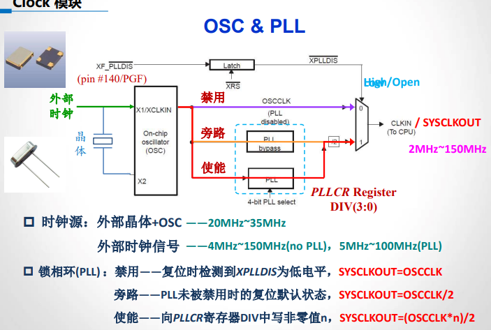

# 一、DSP概述
### 硬件：
- 高速控制和信号处理
- 采用流水线操作
- 采用哈佛结构，数据存储区和程序存储区分离，数据总线和程序总线也是分开的
- 大多配有硬件乘法器和加法器，同一时钟周期内可以完成累加和累乘
- 零开销循环

### 软件：
- 显示MAC（乘加器）指令
- 精简指令集
- 专门的寻址方式

### DSP分类
按数据格式分：
- 定点
- 浮点

按用途分：
- 通用
- 专用

### DSP的应用
1. 数字电机控制
2. 数字电源供应
3. 高级传感器
4. ...


# 二、TMS320F2812

### C2000系列DSP
1. Piccolo系列
   - F2802x, F2803x/5x, F2806x
2. Delfino系列
   - F2833x/23x, C2834x, F2837xS, F2837xD 

### CPU

- 32位定点CPU
- 150MHz
- 当频率为135MHz时，核心电压1.8V；当频率为150MHz时，核心电压为1.9V；输出IO口电压为3.3V

### 内存

- 18kW RAM
- 128kW Flash

### 总线

- 3条地址总线
  - PAB：程序地址总线，**22位**
  - DRAB：数据读地址总线，32位
  - DWAB：数据写地址总线，32位
- 3条数据总线
  - DRDB：数据读数据总线，32位
  - DWDB：数据写数据总线，32位
  - PRDB：程序读数据总线，32位

### 外设功能模块
- 控制类
  - IO
  - 定时器
  - PWM

- 测量类
  - 数字：捕获、正交编码
  - 模拟：ADC

- 通讯类
  - UART
  - eCAN
  - SPI
  - McBsp

### 其他
外设中断扩展模块（PIE）
- 支持45个外部中断

片上存储器
- 128kW Flash，受到CSM（Code Security Module）保护
- 1kW的OTP型存储器（一次性可编程ROM），受到CSM的保护；
- 18kW的SARAM
  - L0和L1：两个4kW的SARAM, 受到CSM的保护
  - H0: 8kW
  - M0和M1：两个1kW的SARAM
- 56个可编程IO口
- 时钟和系统控制
- 3个32位CPU定时器
- 马达控制外设
  - 两个事件管理器
- 12位ADC，16通道

### 寻址方式

1. 直接寻址
2. 间接寻址
3. 寄存器寻址
4. 堆栈寻址
5. 数据/地址/IO空间立即寻址方式
6. 程序空间间接寻址方式

### C28x流水线
- 八级流水线，五个阶段
- 取指令，译码，读取数据，执行，写回

# 三、时钟和系统控制

时钟CLKIN的来源有两种，一种是外部晶振提供，另一种是外部时钟输入。可以通过引脚<span style="text-decoration: overline">XF_PLLDIS</span>来控制选择。

- 晶振：20MHz ~ 35MHz
- 外部时钟：有PLL: 5 ~ 100MHz；无PLL: 4 ~ 150MHz

在使用对应的外设之前，需要使能它们的时钟。与外设时钟使能相关的寄存器是<u>外设时钟使能寄存器PCLKCR</u>。

SYSCLK经过分频可以得到低速外设时钟LSPCLK和高速外设时钟HSPCLK，它们互相独立，分别给高速外设和低速外设供应时钟信号。


### 看门狗电路

当八位的<u>看门狗加法计数器WDCNTR</u>达到最大值时，看门狗模块输出一个512个周期的脉冲，使系统复位。

如果不想使用看门狗，可以直接禁止看门狗。

如果启用了看门狗，当程序正常运行时，我们需要定期向WDCNTR依次顺序写入0x55和0xAA来清零，实现“喂狗”操作。

逻辑校验位是看门狗的另一个安全机制，访问<u>看门狗控制器WDCR</u>的写操作中，相应的校验位必须为“101”，否则会立即拒绝访问并引发系统复位。

### 低功耗模式
- 空闲模式：CPU进入低功耗模式，部分外设不使用时时钟选择性关闭，会自动降低频率来降低功耗，任何使能的外设中断都可以唤醒此模式。
- 暂停模式：片上所有设备停止工作
- 备用模式：关闭CPU和外设时钟，OSC和PLL正常工作

# 四、CPU定时器
x2812内部有3个32位的CPU定时器，其中只有Timer0可供用户使用，Timer1和Timer2都被系统保留。

欲使用CPU定时器来计时，需要设置两个寄存器：

- 周期寄存器 PRDH:PRD
- 分频器寄存器 TDDRH:TDDR

计数器的周期有以下两个公式：

${TIMCLK = \frac{TDDRH:TDDR + 1 }{SYSCLK} * 10^{-6}}$

${Period = (PRDH:PRD + 1) * TIMCLK}$

# 五、编程

## 程序文件

- 源程序文件：C，汇编文件
- 头文件：.h文件
- 命令文件(cmd)：对程序和数据存储空间进行分配
- 运行支持库

## 命令文件

伪指令：

- MEMORY：用来指示存储空间
  - PAGE0：程序空间
  - PAGE1：数据空间
- SECTION：用来分配到储存空间
  - 段：
    - .cinit：存放用来对全局和静态变量初始化的函数
    - .text：存放编译C语言时产生的汇编代码
    - .econst：包含字符串常量、全局变量和静态变量的初始化和说明
    - .ebss：使用大寄存器模式时为全局变量和静态变量所预留的空间
    - .stack：为系统堆栈保留的空间，主要用于函数传递变量和为局部变量分配空间。

# 六、GPIO

总共56个可编程复用IO口，分为ABDEFG六组。复位默认为输入口。可提供4mA输入电流。

寄存器：

- GPxMUX
  - 写0，设置为数字IO口
  - 写1，功能复用
- GPxDIR
  - 写0，输入
  - 写1，输出
- GPxDAT
  - 写0，拉低输出
  - 写1，拉高输出
  - 存在一定的问题，建议使用下面三个寄存器来操作
- GPxSet：只能写1
- GPxClear：只能写1
- GPxTOGGLE：只能写1

```c
// 置位输出
GpioDataReg.GPASET.bit.GPIOA0 = 1;
// 读取输入
if(GpioDataReg.GPASET.bit.GPIOA2 = 0) {
    ...
}
```

 

# 七、中断

中断的类型：

- 触发形式
  - 软件中断
  - 硬件中断
    - 内部中断
    - 外部中断
- 能否屏蔽
  - 可屏蔽中断
  - 不可屏蔽中断

## 中断优先级

在不同组内INT1最大，在PIE同组内，INTx.1最大。

## CPU级中断

CPU中的中断由IER和INTM控制。IER控制每个可屏蔽中断，INTM相当于总闸。

## PIE中断

外设中断扩展模块（PIE），对各种中断请求源进行处理。

PIE一共支持96个中断，这些中断被分为了12个组，每组由8个中断。每个组都被反馈到 <span style="text-decoration:overline" >INT1</span> ~ <span style="text-decoration:overline" >INT12</span> 这12条中断线上的某一条。

## PIE中断向量表

DSP中各个中断服务子程序的地址储存在一片连续的RAM（大小为256x16）内，这就是中断向量表。

## 2812的三级中断系统

三级系统都要允许，某中断才会发生。

- 外设级

  - 当外设中断标志位被置1，且该外设中断为使能状态，此时外设向PIE发出中断请求；
  - <span style="color:red; font-weight:bold">外设中断标志位置位后必须<u>手动清除</u>！！！</span>

  ```c
  CpuTimer0Reg.TCR.bit.TIF = 1;	// 写1来手动清除外设寄存器中的标志位
  ```

  

- PIE级

  - 除了中断标志寄存器和中断使能寄存器，还有中断应答寄存器。
  - 同组内的中断在响应时，如果发生了其他同组中断，若中断应答寄存器没有被手动清零，后发生的中断不会被响应。<span style="color:red; font-weight:bold">中断应答寄存器需要手动清除</span>。PIE级中断的标志位不需要手动清除。

  ```c
  PieCtrl.PIEACK.bit.ACK1 = 1;
  ```

  

- CPU级

  - 当外设中断请求发送到CPU时，CPU的中断标志寄存器IFR对应位置位。这时，CPU检查IER对应的位是否置位，以及INTM是否<span style="color:red; font-weight:bold">为0</span>。


## 中断函数的编写

1. 使能某个中断：

```c
void InitXXX(void) {
    ...
    CpuTimer0Regs.TCR.bit.TIE = 1;	// 使能定时器0的周期中断
    ...
}
```

2. 在主函数里：

```c
void main(void) {
    InitXXX();
    DINT;
    IER = 0x0000;
    IFR = 0x0000;
    InitPieCtrl();
    InitPieVectTable():
    // 使能PIE的中断
    PieCtrl.PIEIER1.bit.INTx7 = 1;
    IER |= M_INT1;
    EINT;
}
```

3. 在DSP28_DefaultIsr.c文件里配置中断函数

```c
interrupt void TINT0_ISR(void) {
    ...
    CpuTimer0Regs.TCR.bit.TIF = 1;
    PieCtrl.PIEACK.bit.ACK1 = 1;
    EINT;
}
```


